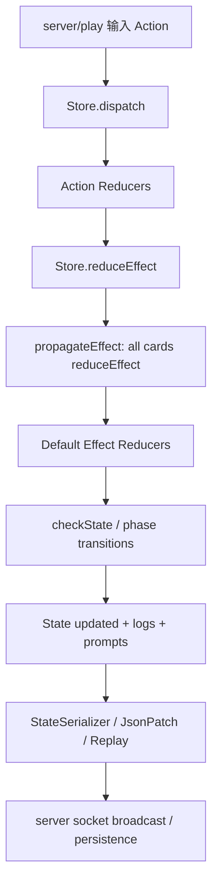
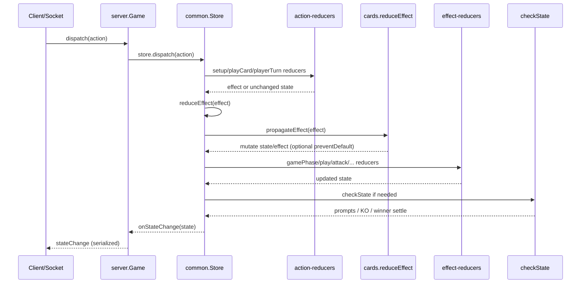
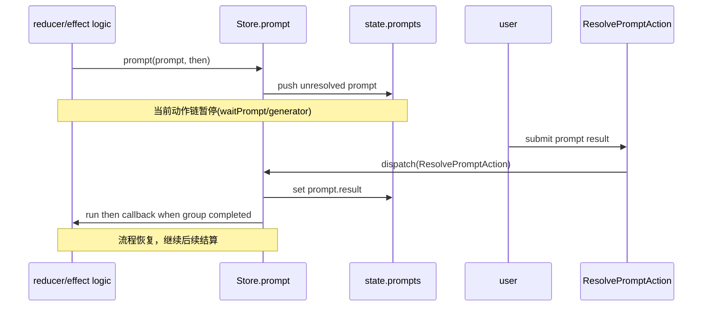

# Ryuu Play `@ptcg/common` 引擎层架构详解

本文档从架构视角梳理 `packages/common` 的实现，重点解释游戏引擎层如何组织、如何执行一回合规则、如何支持卡牌扩展与前后端同步。

---

## 1. 在整体系统中的定位

在仓库分层里，`@ptcg/common` 是规则内核：

- `@ptcg/common`：规则、状态机、动作模型、序列化与回放能力
- `@ptcg/sets`：具体卡牌效果实现（依赖 common 的扩展点）
- `@ptcg/server`：对局编排、网络通信、存储持久化（驱动 common）
- `@ptcg/play`：界面与交互（消费 common 的状态模型）

启动链路中，`start.js` 会在服务启动前把 `CardManager` 的卡定义注入 `StateSerializer`，让状态可反序列化：

- `start.js`
- `init.js`

这意味着：**common 不是“服务端内部细节”，而是全系统共享的领域模型中心**。

---

## 2. 包内分层与职责

`packages/common/src` 可以理解为 3 层：

### 2.1 领域引擎层（核心）

- `store/`
  - `actions/`：玩家意图（出牌、攻击、结束回合、响应 prompt）
  - `effects/`：领域效果对象（可被卡牌与规则处理器共同消费）
  - `reducers/`：Action 级入口与合法性校验
  - `effect-reducers/`：Effect 级默认规则结算
  - `state/`：状态树结构（State、Player、PokemonSlot、CardList）
  - `prompts/`：交互中断机制（选牌、选目标、coin flip）
  - `store.ts`：状态机总调度器

### 2.2 运行支持层

- `game/`
  - `CardManager`：卡牌与 format 注册中心
  - `Simulator`：可自动解决部分 prompt 的离线模拟器
  - `Replay`：状态 diff 序列记录与回放
  - `GameSettings`：规则与时限配置封装

### 2.3 状态同步层

- `serializer/`
  - `StateSerializer`：对象图序列化/反序列化
  - `JsonPatch`：diff/patch 增量传输支持

---

## 3. 核心抽象模型

引擎运行围绕 6 个核心对象：

1. `Action`：外部输入的“意图”
2. `Store`：状态机入口，负责调度 reducer 与错误回滚
3. `Effect`：规则传播单元（卡牌与系统规则都基于它响应）
4. `Card`：可扩展规则节点，每张卡可实现 `reduceEffect`
5. `Prompt`：交互暂停点与恢复点
6. `State`：全局真值（phase、turn、players、prompts、logs）

### 3.1 Action 与 Effect 解耦

`Action` 不直接改状态，而是在 reducer 中转成 `Effect`：

- `PlayCardAction` -> `AttachEnergyEffect` / `PlayPokemonEffect` / `PlaySupporterEffect` 等
- `AttackAction` -> `UseAttackEffect`
- `RetreatAction` -> `RetreatEffect`

这种设计让：

- Action 层负责“谁能做什么”
- Effect 层负责“做了之后会触发哪些规则”

---

## 4. 核心执行管线（最关键）

## 4.1 `dispatch(action)`：动作入口

`store.ts` 的 `dispatch` 是总入口，先处理特殊 action，再走主 reducer：

- 特殊分流：`AbortGameAction`、`ResolvePromptAction`、`AppendLogAction`
- 当存在未完成 prompt 时，拒绝新 action（`ACTION_IN_PROGRESS`）
- 其他 action 统一进入 `reduce`

`reduce` 的特性：

- 先深拷贝 state（异常时回滚）
- 按顺序执行 action-reducer：
  - `setupPhaseReducer`
  - `playCardReducer`
  - `playerTurnReducer`
- 若没有挂起 prompt，执行一次 `checkState`

这保证了动作处理“要么完整成功，要么不生效”。

## 4.2 `reduceEffect(effect)`：效果传播入口

`Store.reduceEffect` 是规则层核心：

1. `propagateEffect`：先遍历全场卡牌，逐卡执行 `card.reduceEffect`
2. 若 `effect.preventDefault` 被置为 `true`，停止默认结算
3. 否则进入默认 effect-reducer 链：
   - `gamePhaseReducer`
   - `playEnergyReducer`
   - `playPokemonReducer`
   - `playTrainerReducer`
   - `retreatReducer`
   - `gameReducer`
   - `attackReducer`
   - `checkStateReducer`

这是一种“**插件优先 + 内核兜底**”架构：卡牌先改写语义，默认规则后执行。

## 4.3 `propagateEffect` 的意义

`propagateEffect` 会扫描双方所有区域中的卡：

- active/bench 的 pokemon/energy/trainer
- stadium/supporter
- hand/deck/discard/lostzone/prize

随后按 `superType` 排序，再调用每张卡的 `reduceEffect`。

架构意图：

- 卡牌效果实现分布式注入，不需要集中 switch-case
- 全局效果（例如“在场时生效”）天然可被动响应
- 新卡扩展无需改核心分发表

---

## 5. Prompt 机制：同步状态机里的“异步交互”

引擎没有直接用 async/await 作为规则流程，而采用：

- `store.prompt(...)` 记录 prompt 到 `state.prompts`
- `ResolvePromptAction` 提交结果
- 所有关联 prompt 完成后执行回调
- `store.waitPrompt(...)` + generator 实现“暂停/恢复”

典型使用处：

- `setup-reducer.ts` 的开局流程（洗牌、选起始宝可梦、决定先后手）
- `game-effect.ts` 的攻击流程（混乱判定、选攻击等）
- `check-effect.ts` 的 KO 后续（拿奖赏、补 active）

这套机制使复杂规则时序仍能保持单线程、可回放、可验证。

---

## 6. 状态校验与胜负收敛（`checkState`）

`check-effect.ts` 的 `checkState` 是规则一致性守门员，主要负责：

1. 桌面约束检查（如 bench size 变化）
2. KO 检测与处理（`KnockOutEffect`）
3. 奖赏卡领取 prompt
4. 无 active 时补位 prompt
5. 胜负判定（奖赏拿完、无 active）

重要设计点：

- `checkState` 不只在回合结束触发，而是多个关键流程后触发
- 通过 generator + prompt 链，保证中途决策仍能回到同一收敛流程
- `endGame` 只在合法 phase 允许触发，避免非法状态跳转

---

## 7. 一回合行为链路（架构视角）

下面以常见动作说明从“输入到落盘”的路径。

### 7.1 出牌（PlayCard）

1. `PlayCardAction` 进入 `play-card-reducer.ts`
2. 检查当前是否轮到该玩家、手牌 index 是否合法、目标位是否合法
3. 根据卡类型构建对应 effect（能量/宝可梦/训练家）
4. 进入 `store.reduceEffect`
5. 先卡牌传播，再默认规则处理

### 7.2 攻击（Attack）

1. `AttackAction` -> `UseAttackEffect`
2. `gameReducer` 中 `useAttack` 流程：
   - 检查状态异常（麻痹/睡眠）
   - 计算并校验能量
   - 处理混乱 coin flip prompt
   - 触发 `AttackEffect`
   - 伤害结算 `DealDamageEffect` -> `ApplyWeaknessEffect` -> `PutDamageEffect`
   - `EndTurnEffect`
3. 回合收尾进入 `gamePhaseReducer` 与 `checkState`

### 7.3 撤退（Retreat）

1. `RetreatAction` -> `RetreatEffect`
2. `retreatReducer` 校验：
   - 目标 bench 是否有宝可梦
   - 是否被特殊状态阻挡
   - 本回合是否已撤退
3. 计算撤退费用，不足则报错
4. 若需支付能量，挂 `ChooseEnergyPrompt`
5. 支付后切 active/bench

---

## 8. 状态模型设计（为什么这样建）

## 8.1 `State` 全局字段

- `phase`：生命周期相位（WAITING/SETUP/PLAYER_TURN/ATTACK/BETWEEN_TURNS/FINISHED）
- `turn`、`activePlayer`：回合推进
- `players`：玩家状态
- `prompts`：待响应交互
- `logs`：可展示日志
- `cardNames`：序列化还原卡对象的关键索引

## 8.2 `Player` 与 `CardList`

`Player` 把所有区域显式建模（deck/hand/discard/lostzone/stadium/supporter/active/bench/prizes），并维护本回合标记：

- `energyPlayedTurn`
- `retreatedTurn`
- `stadiumPlayedTurn`
- `stadiumUsedTurn`

`CardList` 提供统一迁移 API（`moveTo`/`moveCardsTo`/`discard`/`toLostZone`），减少区域移动逻辑重复。

`refreshCardListTargets` 在关键路径频繁调用，用于重新绑定默认 discard/lostzone 目标，避免引用失效。

---

## 9. 序列化、增量同步与回放

## 9.1 `StateSerializer`

核心能力：

- 处理对象图中的循环引用（`Ref` 路径）
- 为不同类型对象分派 serializer（Card/CardList/Prompt/StateLog）
- 通过 `cardNames` + `knownCards` 恢复卡牌实例

`StateSerializer.setKnownCards(...)` 是运行时必要前置条件，否则无法反序列化卡对象。

## 9.2 `JsonPatch`

`serializeDiff(base, state)` 会输出差异，减少网络或存储体积。  
`applyDiff` 能在基线状态上重建最新状态。

## 9.3 `Replay`

`Replay.appendState` 存储连续 diff，并可按跳点建索引以提升随机访问回放性能。  
服务端 `MatchRecorder` 在状态变化时持续写入 replay，结束后持久化。

---

## 10. 与 server/play 的协同边界

## 10.1 server 如何驱动 common

- `Game`（server）持有 `Store`
- socket action 映射为 common 的 `Action`
- `game.dispatch()` 调用 `store.dispatch()`
- `onStateChange` 触发广播与录制

## 10.2 play 如何消费 common

- 接收序列化 state（经 server sanitizer 处理）
- 按 `prompt` 渲染交互
- 用户选择后发送 `ResolvePromptAction`

因此 common 的接口稳定性直接决定前后端协作成本。

---

## 11. 扩展指南（从架构角度）

## 11.1 新增卡牌效果（推荐路径）

在 `@ptcg/sets` 卡类里实现 `reduceEffect`：

- 监听你关心的 effect 类型（如 `TrainerEffect`、`AttackEffect`、`PowerEffect`）
- 修改 effect 参数或 state
- 必要时设置 `effect.preventDefault = true`
- 尽量复用已有 effect，不新增 action

优先原则：**卡牌逻辑放 sets，通用规则放 common**。

## 11.2 新增通用规则

适用于“非某一张卡特有”的机制：

1. 在 `effects/` 定义新 effect（如需要）
2. 在对应 `effect-reducers/` 实现默认结算
3. 在 action-reducer 中触发该 effect
4. 必要时补 `checkState` 收敛逻辑
5. 增加 serializer/prompt 支持（如引入新对象）

---

## 12. 架构优缺点与演进建议

### 12.1 优点

- 高扩展：卡牌能力通过 `reduceEffect` 注入
- 高一致：所有动作统一经过状态机与校验
- 可回放：原生支持 diff 回放与序列化
- 易测试：`Simulator` 可自动处理固定 prompt

### 12.2 代价

- effect 传播是全场扫描，复杂局面下有性能压力
- reducer 链为硬编码顺序，新增机制需关注顺序副作用
- prompt + generator 模式可读性门槛较高

### 12.3 建议

- 为 effect-reducer 顺序增加文档化“依赖约束”
- 对高频 `propagateEffect` 增加 profiling 与剪枝策略
- 在复杂卡牌场景补充回归测试模板（攻击链、prompt 链、KO 链）

---

## 13. 一句话总结

`@ptcg/common` 的引擎本质是：  
**用 Store 驱动 Action->Effect 流水线，以“卡牌先传播、规则后收敛”的模式，在同步状态机里安全地承载复杂交互式对局规则。**

---

## 14. 架构图与时序图（评审版）

### 14.1 模块依赖图（Common 视角）

### 14.2 Action 到状态变更时序图

### 14.3 Prompt 挂起与恢复时序图

---

## 15. 核心源码索引（按职责）

下表用于快速定位“某类问题应该读哪段代码”。

| 关注点 | 主文件 | 说明 |
|---|---|---|
| 状态机总入口 | `packages/common/src/store/store.ts` | `dispatch`、`reduce`、`reduceEffect`、回滚与 prompt 队列 |
| 开局流程 | `packages/common/src/store/reducers/setup-reducer.ts` | 加入玩家、套牌校验、起手、先后手、首回合初始化 |
| 出牌动作解析 | `packages/common/src/store/reducers/play-card-reducer.ts` | 按卡类型把 action 转成 effect |
| 回合动作（攻击/能力/撤退/过牌） | `packages/common/src/store/reducers/player-turn-reducer.ts` | 行为合法性门禁与 effect 触发 |
| 攻击结算 | `packages/common/src/store/effect-reducers/game-effect.ts`、`attack-effect.ts` | 能量校验、攻击流程、弱点抗性、伤害落地 |
| 回合推进 | `packages/common/src/store/effect-reducers/game-phase-effect.ts` | between turns、抽牌、结束回合 |
| KO/胜负收敛 | `packages/common/src/store/effect-reducers/check-effect.ts` | KO、奖赏、补 active、判定 winner |
| 撤退机制 | `packages/common/src/store/effect-reducers/retreat-effect.ts` | 撤退费用、状态限制、选择能量弃置 |
| 共享工具 | `packages/common/src/store/state-utils.ts` | 目标定位、能量支付判断、owner/opponent 查找 |
| 状态结构 | `packages/common/src/store/state/state.ts`、`player.ts`、`card-list.ts` | 全局状态与区域移动语义 |
| 卡牌扩展点 | `packages/common/src/store/card/card.ts` | `reduceEffect` 钩子定义 |
| 卡池注册 | `packages/common/src/game/cards/card-manager.ts` | set/format 定义、按名字取卡、format 查询 |
| 模拟器 | `packages/common/src/game/simulator.ts` | 自动处理部分 prompt，便于离线推演 |
| 状态序列化 | `packages/common/src/serializer/state-serializer.ts` | 对象图序列化、引用恢复、knownCards |
| 增量 patch | `packages/common/src/serializer/json-patch.ts` | diff/apply 算法 |
| 回放记录 | `packages/common/src/game/replay.ts` | 状态 diff 追加、索引跳转、压缩序列化 |

---

## 16. 典型改动场景与落点建议

### 16.1 想加一个“新卡特性”

- 优先改 `@ptcg/sets` 里的卡类 `reduceEffect`
- 先找最接近的 effect（`TrainerEffect`、`PowerEffect`、`AttackEffect`）
- 只有确实缺少抽象时，再回到 common 新增 effect

### 16.2 想加一个“全局规则”

- 落到 common 的 `effects` + `effect-reducers`
- 明确其在 reducer 链中的顺序要求
- 补 `checkState` 场景用例，避免流程走偏

### 16.3 想优化性能

- 首先 profiling `propagateEffect` 与 `checkState` 触发频率
- 观察大量 prompt 局面下的状态变化次数
- 评估是否引入 effect 订阅索引（按 effect 类型筛卡）来替代全量扫描

---

## 17. 评审清单（给架构/PR review）

- 是否把 action 合法性校验放在 action-reducer，而非卡牌里？
- 是否复用了已有 effect，而不是新增“只用一次”的 effect？
- 是否考虑了 prompt 挂起后恢复路径（包括取消与非法输入）？
- 是否在 `checkState` 收敛后仍保持胜负与 phase 一致性？
- 是否保证序列化可恢复（新对象是否需要 serializer 支持）？
- 是否补了对应层级测试（卡牌测试 + 规则回归测试）？
