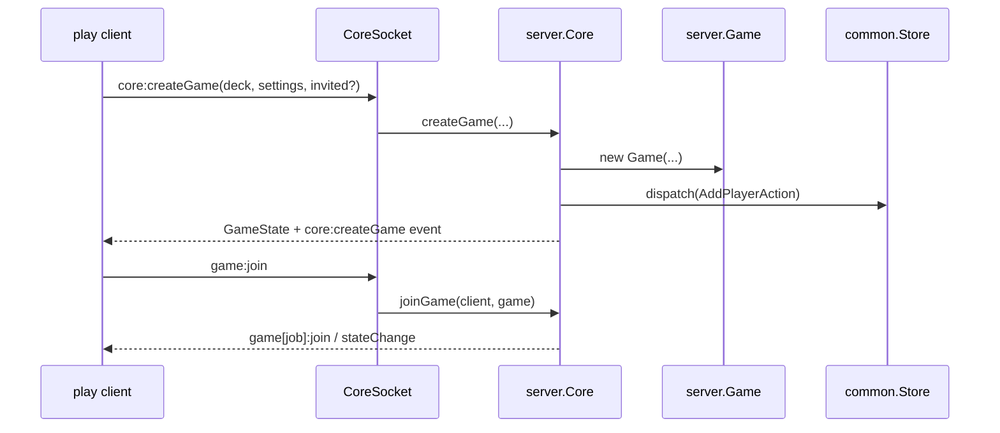
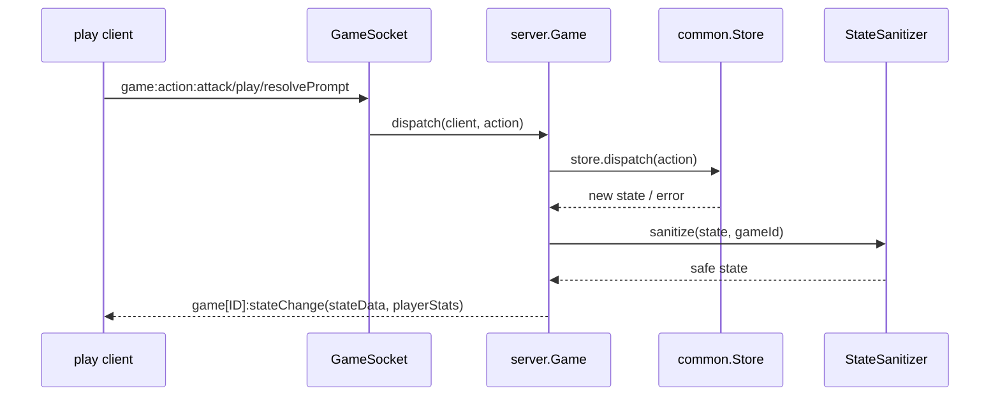
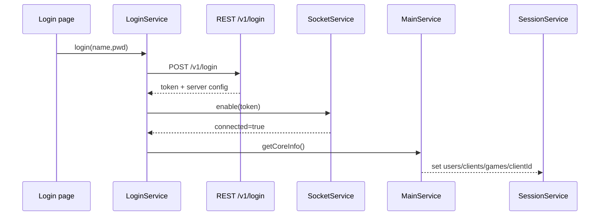
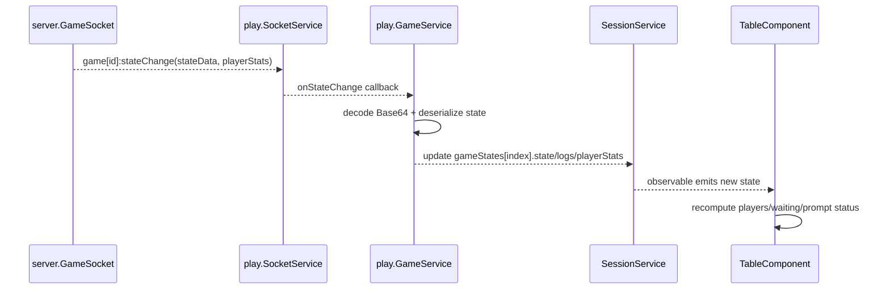

# Ryuu Play `server` 与 `play` 模块架构分析

本文档从架构与实现两个角度，分析：

- `packages/server`：后端服务编排层
- `packages/play`：Angular 前端应用层

并重点说明它们如何协同 `@ptcg/common` 完成在线对战、状态同步与回放。

---

## 1. 全局分层与职责边界

在当前仓库中，职责边界可总结为：

- `@ptcg/common`：规则引擎、状态模型、序列化/回放能力（领域核心）
- `@ptcg/server`：网络入口、对局编排、持久化、bot 与后台任务（运行时中台）
- `@ptcg/play`：UI 展示、交互、会话状态管理、HTTP/Socket 调用（客户端壳层）

设计要点：

- **规则不在 server/play 重写**，而是复用 common
- **server 是 authoritative source**（权威状态）
- **play 不本地推演规则**，只发送 action、接收 state、渲染 prompt

---

## 2. `@ptcg/server` 架构分析

## 2.1 模块分层

`packages/server/src` 主要分为 5 层：

1. `backend/`：对外通信层（Express + Socket.IO）
2. `game/`：对局生命周期与实时编排层（Core/Game/Messager/Bot）
3. `storage/`：TypeORM 持久化层（User/Deck/Match/Replay/...）
4. `simple-bot/`：基础 AI 决策与 prompt resolver
5. `utils/`：调度器、日志、哈希等基础设施

---

## 2.2 服务启动与装配

入口装配在 `backend/app.ts`：

- 初始化 `Storage`（数据库连接）
- 初始化 `Core`（内存中的 client/game 编排中心）
- 配置 Express 路由控制器
- 配置 WebSocketServer
- 提供 scans / avatars 静态资源

同时 `start.js` 在外层完成：

- 加载 `init.js`（注入 format、bots、目录配置）
- `CardManager` 注册卡池
- `StateSerializer.setKnownCards(...)` 注入已知卡定义

这条链路决定了 server 既能处理实时对战，也能可靠序列化 state/replay。

---

## 2.3 HTTP 控制器层（资源型接口）

控制器基于装饰器式注册：

- `Controller` + `@Get/@Post` 绑定路由
- `@AuthToken` 统一鉴权
- `@Validate` 统一参数校验

典型资源接口：

- `login`：登录、注册、刷新 token、服务器配置
- `decks`：牌组 CRUD + 合法性分析（`DeckAnalyser`）
- `cards`：按页分发卡牌定义 + cardsInfo/hash
- `messages`：会话列表、消息历史、删除会话
- `replays`：回放保存、导入导出、重命名、分页检索
- `game`：对局日志与 playerStats 查询

架构风格：

- HTTP 负责**资源访问与管理**（持久化数据）
- 对局动作（attack/play/resolvePrompt）不走 HTTP，走 WebSocket

---

## 2.4 WebSocket 实时层（事件型接口）

`backend/socket` 由三类 socket handler 组成：

- `CoreSocket`：大厅级事件（在线用户、游戏列表、建局）
- `GameSocket`：对局级事件（join/leave、action、stateChange）
- `MessageSocket`：私信事件（send/read）

连接流程：

1. `auth-middleware` 校验 query token
2. 创建 `SocketClient`（实现 `Client` 接口）
3. `core.connect(socketClient)` 纳入在线客户端集合
4. 客户端 attach listeners，开始收发实时事件

这层的核心设计是：**每个连接都映射为统一 `Client` 抽象**，便于 Core 广播。

---

## 2.5 对局编排层（Core / Game）

### Core：系统级编排中心

`game/core/core.ts` 负责：

- 在线客户端管理（connect/disconnect）
- 对局实例管理（create/join/leave/delete）
- 消息中心 `Messager`
- 定时任务启动（ranking 衰减、清理任务）

### Game：单局状态控制器

`game/core/game.ts` 负责：

- 持有 `Store`（来自 common）
- action dispatch 与非法操作计数
- prompt 自动裁决（`Arbiter`）处理可自动化 prompt
- 状态变化广播（`onStateChange`）
- 超时计时器（time limit）
- 对局结束触发删除与回放记录收束

关键结论：

- server 不实现规则细节，而是**调度 common.Store**
- server 的价值在于“会话、连接、权限、时钟、持久化”

---

## 2.6 状态同步与安全裁剪

`GameSocket.onStateChange` 广播 state 前会经过 `StateSanitizer`：

- 过滤已完成 prompt
- 隐藏非当前玩家可见的 secret card
- 将对手 prompt 替换为 `AlertPrompt`
- 增量发送 logs（通过 `lastLogIdCache` 去重）

随后 `StateSerializer + Base64` 序列化后通过 socket 推送。

这确保了：

- 客户端无法通过 payload 窥探不该看到的信息
- 网络传输的数据量可控

---

## 2.7 持久化与后台任务

`Storage` 基于 TypeORM，实体包括：

- `User`, `Deck`, `Match`, `Replay`, `Conversation`, `Message`, `Avatar`

常驻后台能力：

- `CleanerTask`：删除过旧对局、清理长期不活跃低分用户
- ranking 衰减调度：周期性下调排行并通知在线用户
- `BotManager` + `BotGamesTask`：bot 注入与自动约战

这说明 server 不是“纯转发层”，而是具备完整在线服务治理职责。

---

## 2.8 Server 关键时序（Mermaid）

### A. 建局与入局

### B. 对局动作与状态广播

---

## 3. `@ptcg/play` 架构分析

## 3.1 应用分层

`packages/play/src/app` 可以看作 4 层：

1. **页面模块层**：`games/deck/table/messages/replays/profile/ranking/login`
2. **API 层**：`api/`（REST + SocketService + domain services）
3. **会话状态层**：`SessionService`（全局前端状态容器）
4. **共享组件层**：`shared/`（弹窗、工具、卡牌渲染等）

框架特征：

- Angular 模块化 + RxJS 响应式状态
- 不引入独立状态库（如 NgRx），使用轻量 `BehaviorSubject<Session>`

---

## 3.2 路由与页面组织

路由定义在 `app-routing.module.ts`，核心页面包括：

- `/games`：大厅（在线用户/对局列表/建局）
- `/table/:gameId`：对战桌面
- `/deck`、`/deck/:deckId`：牌组管理
- `/message/:userId`：私信
- `/replays`：回放中心
- `/profile/:userId`、`/ranking`
- `/login`、`/register`、`/reset-password`

`CanActivateService` 用会话中 logged user 判断登录态并做登录跳转保护。

---

## 3.3 API 层设计：REST + Socket 双通道

### REST 通道

- `ApiService` 统一包装 `HttpClient`，自动注入 `Auth-Token`
- `ApiInterceptor` 统一处理 timeout、token 失效、限流、验证错误
- 各资源服务负责业务封装：`DeckService/ReplayService/ProfileService/...`

### Socket 通道

- `SocketService` 封装 `socket.io-client`
- 支持 `emit` request/response 模式、`on/off` 订阅管理
- 连接状态通过 `BehaviorSubject<boolean>` 暴露
- Cordova 环境下支持 wake lock，减少移动端断连

核心架构价值：

- REST 用于“资源拉取与管理”
- Socket 用于“实时推送与动作提交”

---

## 3.4 会话状态管理（SessionService）

`SessionService` 是前端全局状态容器：

- 内部 `BehaviorSubject<Session>`
- `get(selector...)` 支持单/多 selector 响应订阅
- `set(partial)` 合并更新
- `clear()` 重置会话

`Session` 保存：

- auth token、server config
- users / clients / games（大厅态）
- gameStates（已加入的本地对局态）
- conversations（消息态）

这是一个“轻量 store”方案，复杂度低，适合中小规模客户端状态管理。

---

## 3.5 大厅与对局协同

`MainService` 负责大厅级实时同步：

- 连接后调用 `core:getInfo` 初始化 users/clients/games/clientId
- 订阅 `core:join/leave/gameInfo/createGame/deleteGame/usersInfo`
- 自动检测“我是玩家但未 join”场景并补 `gameService.join`

`GameService` 负责对局级生命周期：

- `join/leave` 管理本地 `LocalGameState`
- 订阅 `game[id]:join/leave/stateChange`
- decode `stateData`（Base64 + StateSerializer）更新 `state/logs/playerStats`
- 对局动作 API（attack/play/resolvePrompt/...）统一通过 socket 发送

---

## 3.6 Table 页面与 Prompt 渲染

`TableComponent` 负责：

- 根据 `localId/gameId` 取本地对局态
- 结合 `clientId` 计算 top/bottom 玩家视角
- 判断 waiting 状态（轮到谁、是否有未完成 prompt、是否旁观/回放）
- 触发 play（选牌组入局）

`table/prompt/*` 子模块按 prompt 类型拆分组件（choose/move/order/coinFlip/...），
与 common 的 prompt 模型一一对应，实现“规则引擎 prompt -> UI 控件”的映射。

---

## 3.7 回放与消息模块实现特征

### 回放

- `ReplayService` 从 `/v1/replays/...` 拉取 Base64 replay
- 在前端用 common 的 `Replay` 反序列化
- 生成伪 `GameState` 注入 `GameService.appendGameState(...)`
- 复用 table 页与现有渲染体系播放回放

### 消息

- 历史会话/消息走 REST
- 发消息与已读通知走 socket（低延迟）
- `MessageService` 把消息事件写回 `Session.conversations`

---

## 3.8 Play 关键时序（Mermaid）

### A. 登录后初始化

### B. 对局状态更新到 UI

---

## 4. `server` 与 `play` 的协作协议

## 4.1 对齐点

- 协议类型与结构都复用 common（`GameState/CoreInfo/Prompt/Action`）
- `stateData` 编码方式一致（Base64 + StateSerializer）
- prompt 的 decode/validate 在 server 侧进行，play 只做输入承载

## 4.2 关键边界

- server 是权威状态，play 不直接 patch 状态
- play 的动作粒度固定为 action 级，不传业务“结果”
- 敏感信息在 server `StateSanitizer` 处裁剪，不信任客户端

---

## 5. 架构优点与风险

## 5.1 优点

- 领域规则统一在 common，前后端认知一致
- server 分清资源接口与实时接口，职责清晰
- play 通过 SessionService 实现轻量集中状态，维护成本低
- replay 复用 common 与 table 渲染，避免重复实现

## 5.2 风险与技术债

- play 状态更新基于对象替换与手工 merge，复杂场景易出“隐式覆盖”
- server 的 controller/socket 逻辑较分散，跨域变更时需注意一致性
- token 为自签名+共享 secret，缺少更细粒度会话控制能力
- 状态 payload 仍偏大，长局对网络与移动端耗电有压力

---

## 6. 演进建议（可落地）

1. **协议治理**
   - 为 socket 事件建立统一 schema（参数/响应/错误码）文档
   - 增加版本标识，降低前后端滚动升级风险

2. **前端状态治理**
   - 为 `SessionService` 引入“领域切片更新器”（games/messages/replays）
   - 降低 service 间直接改 session 的耦合度

3. **后端可观测性**
   - 在 `Game.dispatch`、`onStateChange`、`StateSanitizer` 增加关键指标
   - 统计 action 错误率、平均 state payload、prompt 往返时延

4. **安全与会话**
   - Token 加入签发版本、设备标识或黑名单机制
   - 为 Socket 事件引入更细权限校验与审计日志

5. **性能**
   - 评估 state diff 推送（而非全量 state）在在线对局通道中的收益
   - 结合常见局面做端到端压测（尤其移动网络下）

---

## 7. 一句话总结

`server` 与 `play` 的架构核心是：  
**用 server 维护权威状态和实时编排，用 play 做状态消费与交互输入，并通过 common 共享协议与规则语义，形成稳定的在线对战闭环。**
